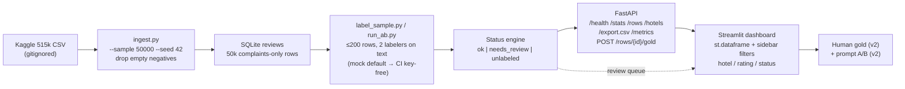
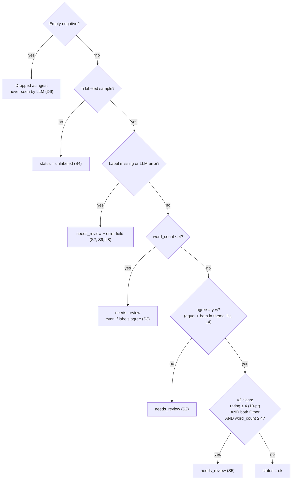

# OpenEval2 — Requirements flow (understanding doc)

Sources: `OpenEval2-HOTEL-SPEC.md` (what the product is), `OpenEval2-FLOWS-TESTS.md` (who does what, how it is verified), and `design.md` (UI design language). `design.md` is the same byte-identical brand-token doc used by the v1 app (Prjct1/Prjct2) — OpenEval2 inherits it for its dashboard.
This file is a reading aid only — it does not add or change requirements. If a conflict appears, the source files win.

Repo: github.com/pmkrafts/openeval2

---

## 1. One-paragraph model

Public Booking.com hotel comments (515k rows, Kaggle, CC0) are sampled to **50,000** rows
(seed 42), rows with an empty negative comment are dropped at ingest, and the negative
text of **≤200** of the rest is coded by **two LLM labelers** against 7 hotel themes.
A row is queued as `needs_review` when the labelers disagree, the text is too short, a
label is missing/errored, or (v2) a low score with two `Other` tags looks suspicious.
human may save an optional gold theme (v2); two prompt versions can be A/B-compared
on the same ids (v2). A FastAPI REST layer + **Streamlit dashboard** expose filtering,
review and export — the browser UI is Streamlit (≥1.57), not React.
The public demo host runs a synthetic hotel-shaped CSV, never the Kaggle file.
The dashboard is styled from `design.md` — a shared brand design-language token
system (single red accent `#e60000`, ink/canvas surfaces, 60 px pill CTAs, no drop
shadows, Inter font substitute) carried over from the v1 app (Prjct2), with no
Vodafone brand assets used.

Requirement chain to remember: **source cap → ingest rule → label rule → status rule → review/export surface → v2 extension → demo/legal guard**, surfaced through the `design.md` token system (§U8–U17).

---

## 2. End-to-end flow

No stage loads 515k, labels >300 with a paid model, or ships the Kaggle CSV to a public host.

---

## 3. Requirements inventory

Grouped by layer, each with an id used in the traceability matrix (§5). Text is quoted or
paraphrased from the sources.

### D — Data & ingest
| ID | Requirement | Source |
|---|---|---|
| D1 | Dataset = "515K Hotel Reviews Data in Europe" (Kaggle, Jiashen Liu, CC0). CSV never committed to git. | SPEC §2 |
| D2 | Store a 50,000-row sample, seed 42, deterministic (same ids across runs). | SPEC §2, TS02 |
| D3 | Full 515k file may live locally; DB holds only the sample. | SPEC §2, H2 |
| D4 | Column mapping: Hotel_Name→hotel, Reviewer_Nationality→nationality, Reviewer_Score→rating (1–10 Booking scale), Positive_Review→text_pos, Negative_Review→text, Review_Date→review_date. | SPEC §2 |
| D5 | "No Negative" / "No Positive" normalize to empty string. | SPEC §2 |
| D6 | Rows with empty negative are **dropped at ingest** (chosen rule) → complaints-only table; that text never reaches the LLM. | SPEC §5.2, H3, TS03, Flow 5 |
| D7 | word_count = word count of negative `text`; 0 if empty. | SPEC §5.1, TS05 |
| D8 | "No Positive" rows may stay when the negative exists (text_pos empty). | TS04 |

### L — Labeling rules
| ID | Requirement | Source |
|---|---|---|
| L1 | Theme list (hotel, not clothing): Location \| Staff \| Room \| Cleanliness \| Food \| Price \| Other. | SPEC §4, H4 |
| L2 | Label the **negative** review (`text`) only, this version. | SPEC §4 |
| L3 | Dual-LLM cap: 200 rows (v1), 100–200 per prompt (v2). | SPEC §2 |
| L4 | agree = label_a == label_b AND both labels in theme list. | SPEC §5.3 |
| L5 | Invalid model output (e.g. "dirty!!!") stored as Other and row → needs_review. | TS13 |
| L6 | Mock labeler is the default path so CI/pytest needs no API key. | FLOWS §B Flow 9, TS44 |
| L7 | No extra LLM retry on quality failures. | Flow 4 |
| L8 | A single LLM error must not crash API/UI; row stays with status + error field set. | Flow 6 |

### S — Status engine & storage
| ID | Requirement | Source |
|---|---|---|
| S1 | Row statuses: `ok` \| `needs_review` \| `unlabeled`. | TS21 |
| S2 | `needs_review` when: word_count < 4 OR agree = no OR missing label OR LLM error. | SPEC §5.4 |
| S3 | Short text → needs_review **even if both labels match**. | Flow 4, TS12 |
| S4 | Unlabeled (outside the labeled sample) long text → status `unlabeled`. | TS15 |
| S5 | Rating clash (v2): rating ≤ 4 on the 10-point scale AND both labels Other AND word_count ≥ 4 → needs_review. | SPEC §5.5, TS14 |
| S6 | Gold label optional and **does not overwrite** A/B labels. | SPEC §5.6, Flow 8 |
| S7 | gold_label persists on refresh; A/B unchanged after gold save. | Flow 8 |
| S8 | Only valid theme values accepted as gold; anything else (e.g. "cheap!!!") → API 400. | Flow 8, TS41 |
| S9 | Row has an error field (set on LLM failure). | Flow 6 |
| S10 | SQLite columns: id, hotel, nationality, rating, text, text_pos, word_count, review_date (+ labels, status, gold). | SPEC §3, §6 |

### A — API
| ID | Requirement | Source |
|---|---|---|
| A1 | Endpoints: GET /health, /stats, /rows, /export.csv, /metrics, /hotels; POST /rows/{id}/gold. | SPEC §3, §6 |
| A2 | GET /rows?limit=&offset=&rating=&status=&hotel= → paged rows; each row: id, text, text_pos, rating, hotel, nationality, label_a, label_b, agree, status, gold_label. | SPEC §6, TS22–25 |
| A3 | GET /hotels → distinct hotels, capped at the 50 most frequent in the sample. | SPEC §6 |
| A4 | GET /stats → total, ok, needs_review, unlabeled. | TS21 |
| A5 | /export.csv honors the same filters and downloads **only filtered** rows. | Flow 7, TS26 |
| A6 | Export CSV: Excel-friendly (BOM), header id, hotel, rating, text, label_a, label_b, agree, status, gold_label. | Flow 7, TS26, H9 |
| A7 | API down → UI error state, not a blank crash. | TS27 |

### U — UI
| ID | Requirement | Source |
|---|---|---|
| U1 | Streamlit `st.dataframe` grid (built-in virtualization); smooth with 50k rows; page via limit/offset (never 515k into the app). | SPEC §2, §11, TS30 |
| U2 | Filters: hotel or rating + status; table counts update to match /stats. | Flow 1/2/7, TS32 |
| U3 | `needs_review` rows visibly marked (color/badge). | TS31 |
| U4 | Long review text wraps; layout holds. | TS33 |
| U5 | Zero rows after a filter → explicit empty message. | TS34 |
| U6 | Stats bar visible: Total / OK / Needs review / Unlabeled. | Flow 2 |
| U7 | UI must not read as a hotel booking site; framing = review-coding tool. | Flow 2 |

### U-design — UI design language (`design.md`, inherited from v1/Prjct2)
| ID | Requirement | Source |
|---|---|---|
| U8 | Entire UI follows the `design.md` token language — colors, type, radii, spacing, elevation — as the single design source. One accent color only; no second accent. | design.md Overview/Colors |
| U9 | Palette: primary red `#e60000` reserved for CTAs + validation/destructive signals (never as large body fill); ink `#25282b` dark bands + headings; canvas `#ffffff` / canvas-soft `#f2f2f2` light surfaces; text body `#7e7e7e`, mute `#bebebe`; on-dark `#ffffff`. | design.md Colors |
| U10 | One type family, no mono: the proprietary face is **not bundled** → substitute Inter (weights 300/400/600/700/800). Hero voice = UPPERCASE weight 800 with `-1px` tracking at display sizes; calmer secondary voice = weight 300 (never below 24 px); body 16–18 px weight 400. | design.md Typography + Font-substitute note |
| U11 | Every interactive CTA renders as a pill (design.md's 60 px `rounded.pill-lg` intent): primary = red fill via theme `primaryColor="#e60000"` + `buttonRadius="full"`; secondary/tertiary via `st.button(type="secondary"/"tertiary")`. No square buttons. White on `#e60000` ≈ 4.8:1 → WCAG AA normal text, AAA display text — never claim AAA for small labels. | design.md Components/Shapes + Streamlit theme keys (1.63) |
| U12 | Non-CTA chrome: content radius 6 px (`rounded.card`), badge/chip pills 32 px (`pill-md`), circular icon containers `rounded.full`; inputs radius 6 px (`rounded.sm`). | design.md Shapes |
| U13 | Depth by surface polarity ink ↔ canvas only; **no soft drop shadows**; elevation = flat, 1 px ink hairline (inputs), 1 px on-dark hairline at ~25 % opacity on dark bands. | design.md Elevation |
| U14 | Page rhythm: dark ink band → light canvas band → dark footer; no mid-band greys. Base spacing 4 px, tokens 8–32 px; card headlines hug copy (8 px gap), 32 px section gutters. | design.md Layout |
| U15 | Responsive: breakpoints <600 / 600–1023 / 1024–1399 / ≥1400 (content caps ≈1400 px); dashboard usable at every breakpoint with ≥52 px touch targets; card-style grids 2-up desktop → 1-up mobile; nav collapses to a dark overlay menu at mobile if nav is present. | design.md Responsive |
| U16 | Status language: `needs_review` = red-accent marker (red doubles as validation signal); `ok` = canvas-soft `badge-chip`; `unlabeled` = mute text. Table header in uppercase-eyebrow style (12 px / weight 600 / +0.57 px tracking); body cells body-sm 16 px. | design.md Components (badge-chip, ex-data-table-cell) + TS31 |
| U17 | No Vodafone brand assets on any surface: no speechmark orb, no wordmark, no Vodafone photography. Only the token *metrics* (colors, type sizes, radii) are reused; fonts substituted per design.md. | design.md font note + demo hygiene (TS52, Prjct2 README privacy) |

**design.md → Streamlit surface map** (full `.streamlit/config.toml` in the tech-stack doc; API references checked against Streamlit 1.63 bundled docs)

| design.md token/component | Streamlit implementation (≥1.57) |
|---|---|
| ink `hero-band-dark`, stats band | header row: 4× `st.metric(border=True)` (Total · OK · Needs review · Unlabeled) in `st.container(horizontal=True)`, fed by GET /stats |
| red `button-primary` pill | theme `primaryColor="#e60000"` + `buttonRadius="full"`; Export CSV = `st.button(type="primary")`, Save gold = `st.form_submit_button` |
| outline secondary/tertiary pills | `st.button(type="secondary"/"tertiary")` (Reset filters / secondary actions) |
| `text-input` (hairline, 6 px) | theme `baseRadius="6px"` + `showWidgetBorder=true`; filter widgets in the sidebar (`st.selectbox` hotel/status, rating control) |
| `badge-chip` pill-md on canvas-soft | status/theme badges via `st.column_config.MultiselectColumn` colored badges or badge markdown; `ok` on canvas-soft |
| red badge = validation (needs_review) | `needs_review` gets the red `#e60000` treatment (row tint via pandas Styler **coloring only**, or red badge); feeds TS31 |
| data-table chrome (eyebrow header, body-sm rows) | `st.dataframe` (`hide_index=True`, `column_config`) — built-in virtualization carries 50k rows (TS30) |
| uppercase-eyebrow table headers | injected CSS on dataframe headers / `st.markdown` styles |
| `ex-empty-state-card` | zero-row branch → `st.info` empty-state message (TS34) |
| toast / error surface | API-down → `st.error` banner (TS27); transient feedback via `st.toast`. Brand rule: no soft drop shadows (U13) — Streamlit is flat by default |
| Marketing-only, **not applied**: editorial hero photography, speechmark orb, nav/footer link farms, pricing-tier / cart-drawer / auth-form / media-button surfaces | no Streamlit role on a review dashboard; no Vodafone imagery per U17 |

### V — v2 (gold + A/B)
| ID | Requirement | Source |
|---|---|---|
| V1 | Save gold on a needs_review row; appears after refresh. | SPEC §1, Flow 8 |
| V2 | Prompt A/B: same ids, two prompt runs → two run records. | SPEC §1, TS43 |
| V3 | Metrics: n, cost, p50_ms, agree v1↔v2 (and per-run). | Flow 9, SPEC §3 |
| V4 | agree_with_gold is null until gold_count ≥ 30. | Flow 8, TS42 |
| V5 | After ≥30 golds, metrics may show agree_with_gold. | Flow 8 |

### P — Demo & legal
| ID | Requirement | Source |
|---|---|---|
| P1 | Public host serves a **synthetic hotel-shaped CSV**; no Kaggle file, no real API key needed to view. | SPEC §5.7, §7, Flow 10, TS52 |
| P2 | README names the Kaggle dataset + sample caps + 10-point score note + "not employer data". | SPEC §5.5, §9, TS50–51 |
| P3 | Do not: load 515k into the UI, label >300 with a paid model, add maps/lat-long viz, new repo, Spark. | SPEC §11 |

---

## 4. Status decision flow (the heart of the loop)

Order matters; evaluated per row after labeling. S2 gates fire before S5.

Notes that prevent misreading the rules:
- **Short text beats agreement**: a 2-word complaint is `needs_review` even when both labelers pick the same theme (S3, TS12).
- **Clash needs long text**: the rating clash fires only at word_count ≥ 4; a short low-score `Other` row is already caught by S3.
- **Score scale is 1–10**, so "rating ≤ 4" is low on Booking's scale, not a 1–5 star cut. README must say this (P2).
- **Invalid model label** ("dirty!!!") is sanitized to `Other` and still queued (L5) — that is why both-`Other` with low rating is treated as suspicious, not as agreement.
- **Gold never mutates A/B** (S6): gold is an analyst overlay for metrics only.
- Empty negatives never exist past ingest, so `word_count = 0` case (S2 gate) cannot occur for ingested rows — the gate still guards sample-time/other inputs (D6 vs SPEC §5.2 "pick one" is already resolved to *drop*).

---

## 5. Traceability matrix

Requirement → user flow(s) that exercise it → test cases that prove it.

### Data & ingest
| ID | Flows | Tests |
|---|---|---|
| D1 | Flow 5, Flow 10 | TS01, TS51 |
| D2 | Flow 1 | TS02 |
| D3 | Flow 1 | H1, H2 |
| D4 | Flow 1 | H8, H9 (surface) |
| D5 | Flow 5 | TS03 |
| D6 | Flow 5, Flow 1 | H3, TS03 |
| D7 | Flow 4 | TS05 |
| D8 | — | TS04 |

### Labeling & status
| ID | Flows | Tests |
|---|---|---|
| L1 | Flow 2/3 | H4 |
| L2 | Flow 3 | H6 (implicit) |
| L3 | Flow 1/9 | H5 |
| L4 | Flow 3 | TS10, TS11 |
| L5 | Flow 4 | TS13 |
| L6 | Flow 9, CI | TS44 |
| L7 | Flow 4 | Flow 4 §3 |
| L8 | Flow 6 | Flow 6 §4 |
| S1 | Flow 2 | TS21 |
| S2 | Flow 4 | TS11, TS13 |
| S3 | Flow 4 | TS12 |
| S4 | Flow 2 | TS15 |
| S5 | Flow 3 (v2) | TS14 |
| S6 | Flow 8 | Flow 8 §3 |
| S7 | Flow 8 | Flow 8 §3 |
| S8 | Flow 8 | TS41 |
| S9 | Flow 6 | Flow 6 §3 |
| S10 | Flow 1 | H5 |

### API & UI
| ID | Flows | Tests |
|---|---|---|
| A1 | Flow 1 | TS20–21, TS26, TS40 |
| A2 | Flow 2/7 | TS22–25, H8 |
| A3 | Flow 2 | H8 (filter source) |
| A4 | Flow 2 | TS21, TS32 |
| A5 | Flow 7 | TS26 |
| A6 | Flow 2/7 | H9, TS26 |
| A7 | — | TS27 |
| U1 | Flow 2 | TS30 |
| U2 | Flow 2/7 | TS32 |
| U3 | Flow 2/3 | TS31 |
| U4 | — | TS33 |
| U5 | — | TS34 |
| U6 | Flow 2 | TS32 |
| U7 | Flow 2 | Flow 2 success/fail |
| U8 | Flow 2/3 | TS30–34 (visual audit) |
| U9 | Flow 2 | TS31, TS32 |
| U10 | — | TS33 |
| U11 | Flow 2/3 | TS26, TS40 |
| U12 | — | TS31 |
| U13 | — | TS33 |
| U14 | — | TS32 |
| U15 | — | TS30 |
| U16 | Flow 2/3 | TS31, TS32 |
| U17 | Flow 10 | TS52 |

### v2 & demo
| ID | Flows | Tests |
|---|---|---|
| V1 | Flow 3/8 | TS40 |
| V2 | Flow 9 | TS43 |
| V3 | Flow 9 | Flow 9 §2 |
| V4 | Flow 8 | TS42 |
| V5 | Flow 8 | Flow 8 §5 |
| P1 | Flow 10 | TS52 |
| P2 | Flow 3/10 | TS50–51 |
| P3 | — | SPEC §11 |

---

## 6. Build order mapped to requirements

From SPEC §9, annotated with what each step satisfies.

1. Download Kaggle zip → `data/` (gitignored) — satisfies D1, D3 locally.
2. Ingest: hotel columns, sample 50k/seed 42, drop empty negatives, map themes in config — D2, D4–D6, L1.
3. Streamlit dashboard: `st.dataframe` with hotel / rating / negative-text / labels / status columns, sidebar filters, design.md theme in `.streamlit/config.toml` — U2, U3 (base), U8–U17.
4. Re-run label_sample mock, then optional LLM on 200 — L3, L6.
5. Keep v2 gold + A/B on this schema — S5–S8, V1–V5, L5.
6. README: dataset URL, sample cap, 10-point scores — P2.
7. Stop — P3.

---

## 7. Quick orientation for newcomers

- **Where does a requirement live?** SPEC §2 (data), §5 (rules), §6 (API), §7 (scenarios); FLOWS §B (user journeys), §C (scenarios).
- **What is the one rule that drives everything?** S2: disagreement / short text / missing or errored label → `needs_review`.
- **What is v2?** Analyst gold (S6–S8, V1) + prompt A/B (V2–V5). v1 = dual-LLM + review queue only.
- **What drives the UI look?** `DOCS/design.md` tokens applied through Streamlit's theme (`.streamlit/config.toml`: red `#e60000` primary, ink text, canvas surfaces, pill buttons, Inter font) + small CSS injection. No React/Node/Vite; Vodafone logo/photography assets are never used — tokens only (U8–U17).
- **Demo story:** "515k public source → 50k stored sample → ≤200 LLM-coded complaints → human reviews the disagreements."
